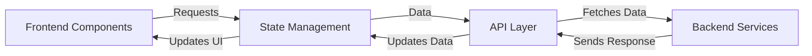

This diagram shows the architecture overview of a TypeScript/React mobile portfolio application, illustrating the interaction between different layers such as Frontend Components, State Management, API Layer, and Backend Services.